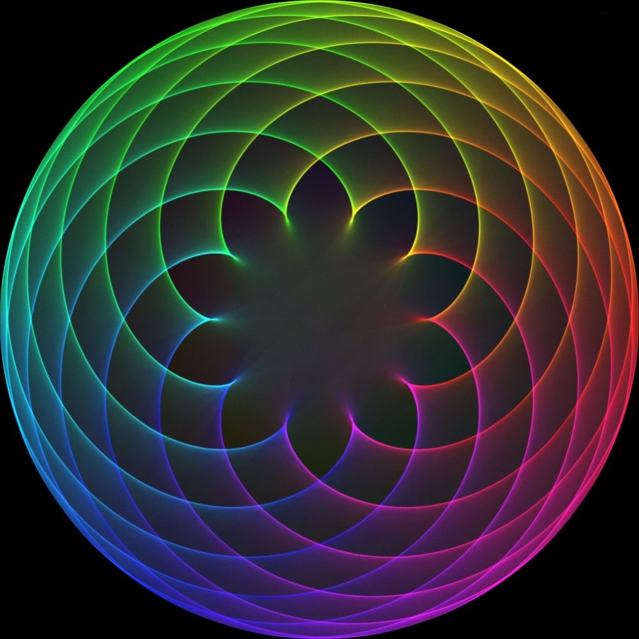

# TimesTableWebGL

A interactive visualization of times tables.

Inspired by [this video from Mathologer](https://www.youtube.com/watch?v=qhbuKbxJsk8).

## Features

-   fluent animation powered by the GPU
-   GUI for visualization parameters
    -   continues animation of the multiplier
    -   line coloring
    -   line opacity
    -   Multisample anti-aliasing
    -   viewport/camera
-   viewport mouse controls
    -   Zoom: `shift + scroll wheel`
    -   Pan: `shift + click + drag`

## Technical notes

### Languages

-   TypeScript
-   WebGL Shaders in [GLSL](<https://www.khronos.org/opengl/wiki/Core_Language_(GLSL)>)

### Libraries

-   [three.js](https://threejs.org/)
-   [dat.gui](https://github.com/dataarts/dat.gui)
-   [webpack](https://webpack.js.org/)
